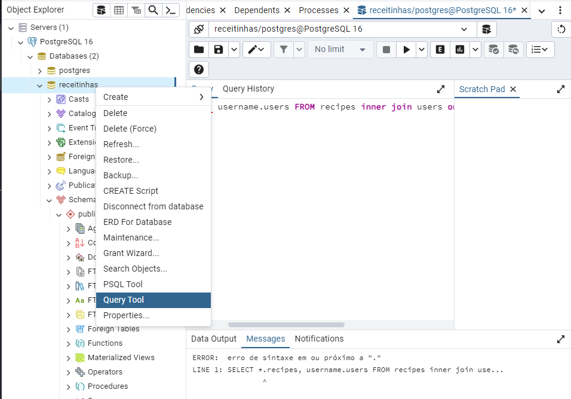

# Projeto Full Stack

Este projeto é composto por duas partes principais: a API e o Aplicativo. A pasta `Api` contém o servidor backend, enquanto a pasta `App` contém o frontend desenvolvido em React.

## Instruções para Rodar o Projeto

### Pré-requisitos

- Node.js
- NPM (Node Package Manager)

### Rodando a API

1. Navegue até a pasta `api`:

    ```sh
    cd api
    ```

2. Instale as dependências:

    ```sh
    npm install
    ```

3. Inicie o servidor:

    ```sh
    node server.js
    ```

    O servidor estará rodando em `http://localhost:3000`.

### Rodando o Aplicativo

1. Navegue até a pasta `app`:

    ```sh
    cd app
    ```

2. Instale as dependências:

    ```sh
    npm install
    ```

3. Inicie o aplicativo:

    ```sh
    npm run dev
    ```

## Observações

- Certifique-se de que a API esteja rodando antes de iniciar o aplicativo React para garantir que todas as funcionalidades funcionem corretamente.
- Se você encontrar qualquer problema, verifique se todas as dependências foram instaladas corretamente e se os servidores estão rodando nas portas corretas.

## Como criar o banco de dados

- Copie todo o conteudo do db.sql, cole e rode(F5)
---

Feito com ❤️ por amandinha
